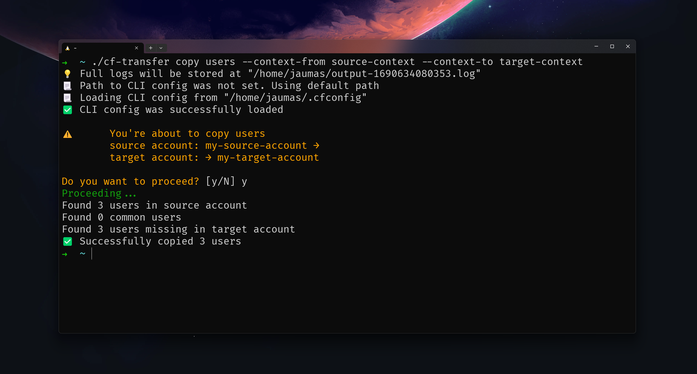

# Codefresh transfer

This little helper allows you to copy some entities from one of your Codefresh
accounts to another, as well as to easily compare them.

## Installation

Please dowload latest binary from
[Releases section](https://github.com/codefresh-support/cf-transfer/releases).

This helper relies on the
[Codefresh CLI](https://codefresh-io.github.io/cli/getting-started/) config to
get the access tokens it needs to work. Make sure that Codefresh CLI is
installed and has the necessary contexts for the accounts you plan to operate
with.

## Usage

### Available entities

- `users`
- `admins`
- `teams`
- `rules`

### Available commands

#### `compare <enitites>`

Compares entities in both accounts and shows the delta.

#### `copy <entities>`

Copies _missing_ entities from the source account to the target one.

- `copy users`: Adds all missing users from the source account to the target
  one.
- `copy admins`: In target account, sets as admins all users who are admins in
  the source one.
- `copy teams`: Adds all missing teams from the source account to the target
  one, preserving the list of their members. ⚠️ Default teams “users” and
  “admins” are ignored regardless of their titles.
- `copy rules`: Adds all missing ABAC rules from the source account to the
  target one.

### Recommended copying order

`users` → `admins` → `teams` → `rules`

### Available options

- `--context-from` — context name for source account.
- `--context-to` — context name for target account.
- `--cfconfig-path` [ optional ] — path to the Codefresh CLI config. If not set,
  default path will be used (Linux/Apple: `$HOME/.cfconfig`, Windows:
  `%USERPROFILE%\.cfconfig`).
